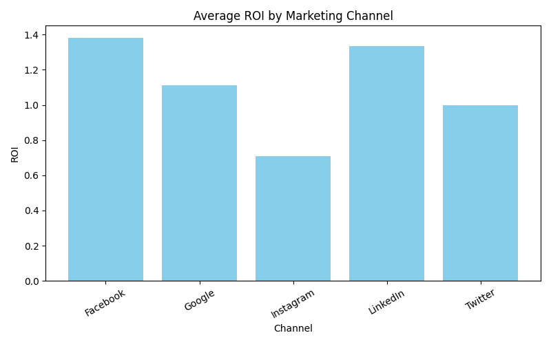

# 📊 Marketing Data Automation Tool

This project automates the **cleaning, analysis, and visualization** of marketing campaign data using **Python, Pandas, and Matplotlib**.

---

## 🚀 Features
- ✅ Loads and cleans marketing campaign data (CSV format)  
- ✅ Calculates **ROI per channel**  
- ✅ Generates a **summary report** (`marketing_summary.csv`)  
- ✅ Creates a **visual ROI chart** (`roi_by_channel.png`)  

---

## 📂 Files in This Project
- `marketing_data.csv` → Sample dataset  
- `marketing_analysis.py` → Main analysis script  
- `marketing_summary.csv` → Generated summary output  
- `roi_by_channel.png` → ROI visualization chart  

---

## 🛠️ Technologies Used
- **Python 3.x**  
- **Pandas** (data analysis)  
- **Matplotlib** (data visualization)  

---

## 📈 Example Output
ROI chart generated by the script:

---

## ▶️ How to
